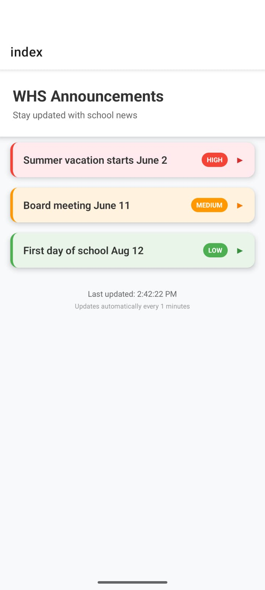

# WHS Announcements App

## Installation

1. Install node.js:
https://nodejs.org/en/download

2. Install dependencies:

   ```bash
   npm ci
   ```

3. Start the app:

   ```bash
   npm run start
   ```

This will open the Expo Developer Tools in your browser. You can run the app on a physical device using Expo Go or on an emulator/simulator.

## Home Page


